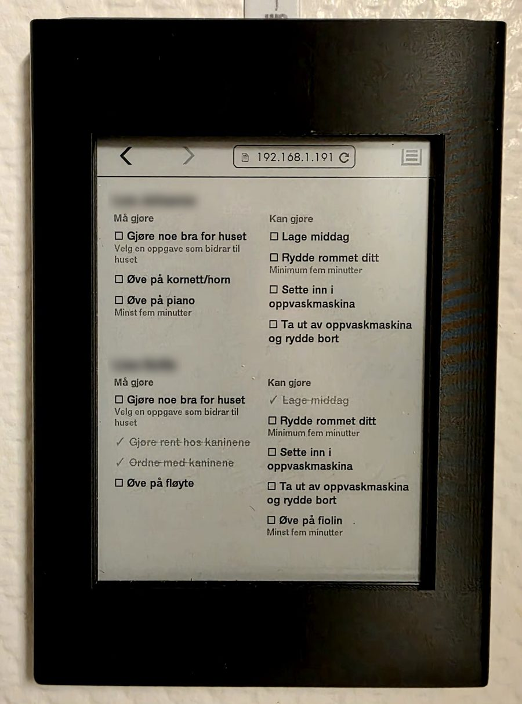

# Chores Kindle

A wall-mounted chore list for an e-ink Kindle, powered by
[Chores](https://chores.apphub.casa).

<p align="center">
  
</p>

Each child gets a section with two columns: **Må gjøre** (must do) and
**Kan gjøre** (can do). Tap a chore to check it off and tap it again to undo.
Finished chores are struck through. The page refreshes every minute, so
chores completed on a phone or in Home Assistant show up on the wall as well.

## How it works

The Kindle's built-in *Experimental Browser* is old and slow, too limited
for the full Chores web app. So `chores-kindle` is a small Go server on
your local network that does the work:

```
Kindle browser ──HTTP──▶ chores-kindle (:8999) ──HTTPS + token──▶ chores.apphub.casa
```

- It serves one plain HTML page (black and white, ES5 JavaScript) that
  suits an e-ink screen.
- It calls the [Chores API](https://buf.build/apphub/chores) using a personal
  access token, so the Kindle never sees a password or a token.
- On startup it finds your family by itself, so you don't need to configure
  anything except the token.
- It's a single static binary with no dependencies.

## Setup

### 1. Create a token

In the [Chores app](https://chores.apphub.casa), go to **Settings** and
create a personal access token.

### 2. Run the server

Download the latest binary (Linux amd64) from
[Releases](https://github.com/gunnaringe/chores-kindle/releases/latest), or
[build it yourself](#building). Then run:

```bash
CHORES_API_TOKEN=your_token ./chores-kindle            # listens on :8999
CHORES_API_TOKEN=your_token ./chores-kindle -port 9001 # or pick a port
```

To keep it running, install it as a systemd service with the unit file
[`chores-kindle.service`](chores-kindle.service):

```bash
sudo install -D chores-kindle /opt/chores-kindle/chores-kindle
sudo cp chores-kindle.service /etc/systemd/system/
sudo systemctl edit chores-kindle   # set Environment=CHORES_API_TOKEN=...
sudo systemctl enable --now chores-kindle
```

### 3. Point the Kindle at it

1. On the Kindle, open **⋮ → Experimental Browser**.
2. Go to `http://<server-ip>:8999`.
3. Bookmark the page so you can get back to it quickly.

### 4. Keep the screen on

By default, a Kindle goes to sleep and shows its screensaver. On many models
you can stop that by typing `~ds` in the home-screen search box and pressing
Enter, which disables the screensaver until the next reboot. Newer firmware
may have removed this, in which case a jailbroken Kindle is the reliable
option. The page also requests a
[Screen Wake Lock](https://developer.mozilla.org/en-US/docs/Web/API/Screen_Wake_Lock_API),
which helps on browsers that support it.

## Building

Requires Go 1.23+.

```bash
CGO_ENABLED=0 go build -ldflags="-s -w -buildid=" -trimpath -o chores-kindle main.go
```

Every push to `main` publishes a `latest` pre-release, and every `v*` tag
publishes a versioned release. Release binaries are compressed with UPX.

## Related

- [Chores](https://github.com/gunnaringe/chores): the app and API this
  displays ([chores.apphub.casa](https://chores.apphub.casa))
- [Chores for Home Assistant](https://github.com/gunnaringe/chores-homeassistant):
  todo lists, sensors and services for Home Assistant
